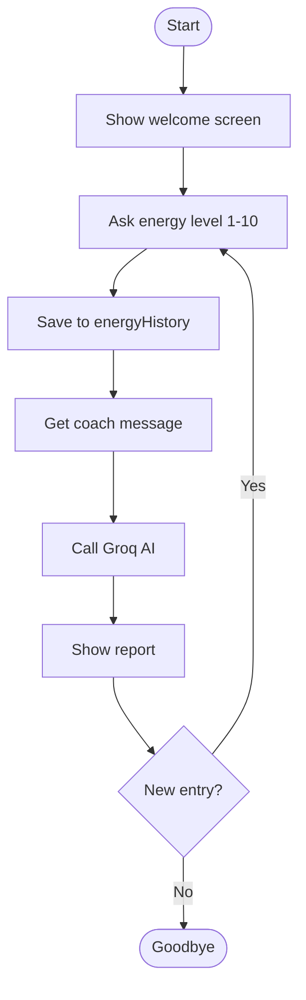
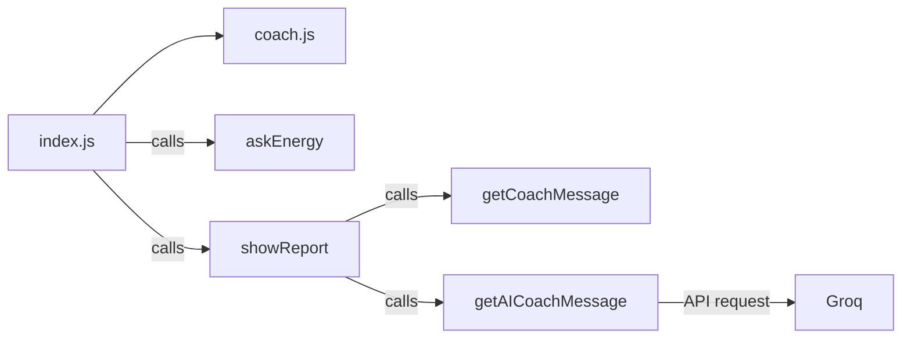

# ⚡ FALLOW Energy CLI

The first prototype of the FALLOW app — a terminal-based energy tracking and AI coaching tool.

## 🚀 About

A CLI application that tracks the user's daily energy level, analyzes past records, and provides personalized coaching messages powered by Groq AI.

## ✨ Features

- Daily energy input (1-10)
- AI coach messages (Groq - Llama 3.3)
- Energy history tracking
- Average energy calculation
- Analysis of high and low energy days
- Multiple entry support

## 🛠️ Technologies

- Node.js
- Groq SDK (Llama 3.3 70B)
- dotenv

## 📁 File Structure
```
fallow-energy-cli/
├── index.js        → Main application
├── coach.js        → AI coach and message logic
├── .env            → API key (private)
└── .gitignore
```

## 🔄 Program Flow


## 🧩 Module Diagram


## ⚙️ Installation

1. Clone the repo
```bash
git clone https://github.com/BeratTansu/fallow-energy-cli.git
cd fallow-energy-cli
```

2. Install packages
```bash
npm install
```

3. Create `.env` file
```
GROQ_API_KEY=your_api_key
```

4. Run
```bash
node index.js
```

## 🎯 Example Run
```
================================
  FALLOW Energy Tracker 0.1
================================
Enter your energy level (1-10): 8

--------------------------------
🔥  Energy: 8/10
💬 FALLOW: "Berat, Amazing! You can do great things today."
🤖 AI Coach: "Your energy is great, focus on your goals today!"
--------------------------------
📊 History:
Day 1: 8
⭐ Average Energy: 8/10
💪 Strong days: 8
😴 Low energy days:
```

## 👨‍💻 Developer

Berat Tansu Çabuk — Developed as part of the FALLOW project.
